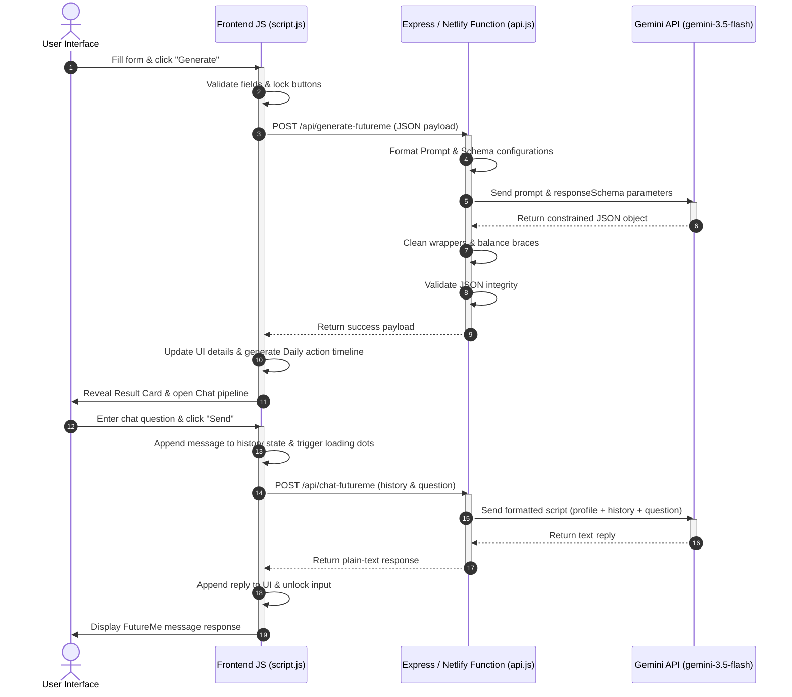

# FutureMe Systems Architecture

This document outlines the full technical stack, system design, and implementation flows of **FutureMe**, an AI-powered personal reflection platform.

---

## 1. The Technology Stack

FutureMe is constructed using a modern, lightweight, and production-ready architecture designed for high execution speed and low maintenance overhead:

1. **Frontend Core**: 
   * **HTML5**: Structured semantic layout utilizing class-based animations.
   * **CSS3**: Vanilla stylesheets featuring custom properties, Glassmorphism design elements (translucency, backdrop-blur, variable border overlays), HSL colors, and custom timeline animations.
   * **JavaScript (ES6+)**: Vanilla client-side script managing state parameters, AJAX fetches, clipboard copying, and dynamic UI renders.
2. **Backend Services**:
   * **Node.js**: Underlying JavaScript runtime for local server hosting and serverless functions compilation.
   * **Express**: Backend routing manager directing application endpoints and static files hosting.
3. **Serverless Infrastructure**:
   * **Netlify**: Serverless hosting platform serving static assets globally.
   * **Netlify Functions (`serverless-http`)**: Wraps the Express application router into serverless Lambda functions, eliminating the need to manage a physical, long-running server.
4. **Artificial Intelligence Engine**:
   * **Gemini API (`gemini-3.5-flash`)**: Google's high-efficiency, low-latency LLM model.
   * **@google/generative-ai SDK**: Official Google client wrapper to manage chat payloads and content requests safely.

---

## 2. Core Capabilities & Mechanics

### A. The Identity Blueprint
When a user completes the reflection form, the application calls the `POST /api/generate-futureme` API. We constrain the LLM's response structure using three systems:
1. **Persona Injection**: The prompt instructs Gemini to assume the persona of the user's future self who has already achieved their target goal, speaking with the chosen tone (Motivational, Brutally Honest, Calm Mentor, or CEO Mode).
2. **JSON Schema Constraint**: We configure the API parameter `responseSchema` forcing the Gemini model to return a structured JSON object containing exact keys:
   * `message` (italics block message)
   * `futureIdentity` (badge text)
   * `nextMoves` (action list)
   * `habit` (daily action box)
   * `warning` (critical warning box)
   * `mantra` (italic mantra box)
   * `dailyPlan` (motivational 3-step action schedule)
3. **Safe Parsing & Brace Balancing**: If the network response contains markdown wrappers or extra trailing characters, a custom depth-balancing parser extracts the first fully valid JSON block, ensuring `JSON.parse` never crashes.

### B. Real-Time Conversation Loop
After the blueprint is generated, a chat thread opens. The user can converse with their future self using `POST /api/chat-futureme`:
* The frontend preserves user details and appends previous messages to a local state history array.
* The backend converts this history array into a formatted script which is sent to Gemini, ensuring the model maintains continuity, recalls the initial goal/struggles, and adheres to the selected tone.

---

## 3. Data Flow Diagram



---

## 4. Netlify Deployment Layout

To host this hybrid app serverlessly on Netlify, we configure redirects and build scripts:
1. **Static Publishing**: The static frontend (HTML, CSS, JS) resides in the `frontend/` folder. Netlify serves it directly as a CDN-hosted site.
2. **Serverless Routing**: The `netlify.toml` file instructs Netlify to route all `/api/*` traffic to the serverless function `/functions/api.js`:
   ```toml
   [build]
     publish = "frontend"
     functions = "functions"

   [[redirects]]
     from = "/api/*"
     to = "/.netlify/functions/api/:splat"
     status = 200
   ```
3. **Environment Security**: The `GEMINI_API_KEY` is saved securely in the Netlify Dashboard site environment settings, meaning it is never exposed to public frontend clients.
